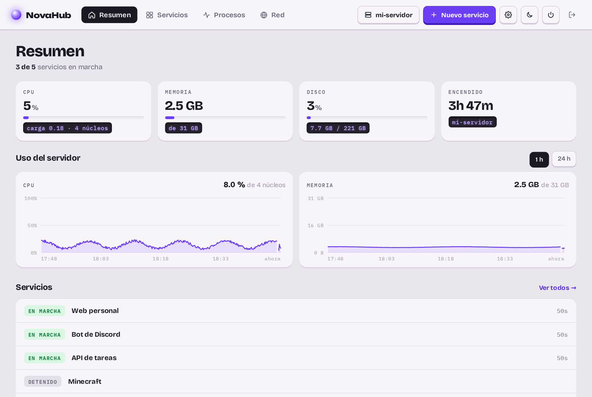
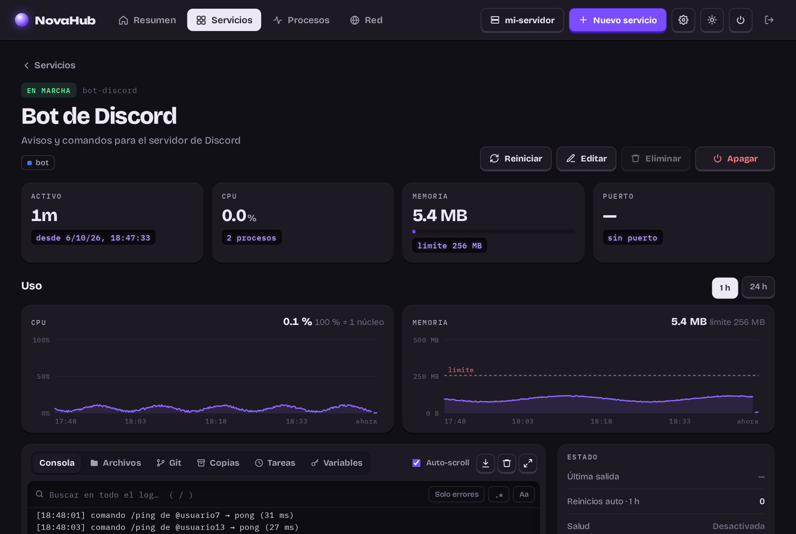
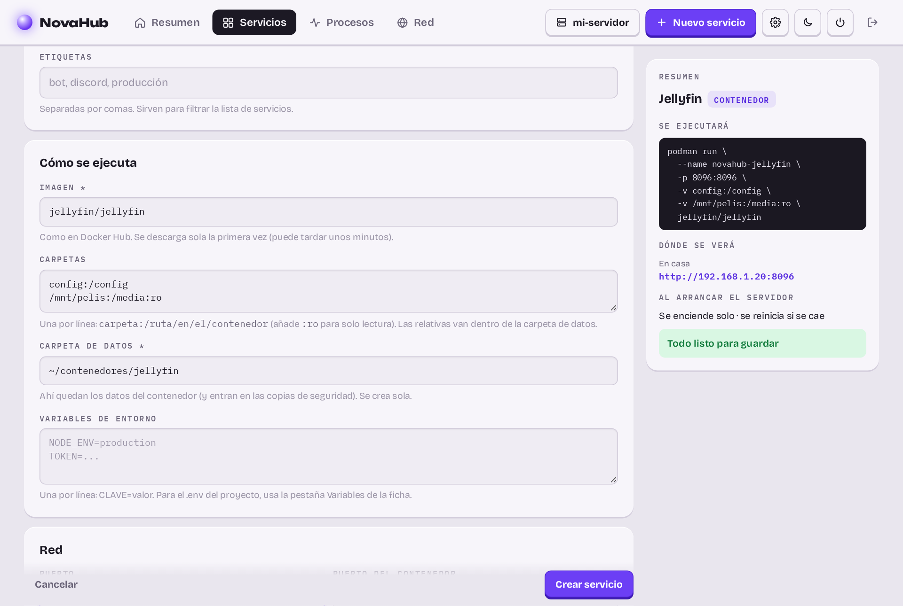
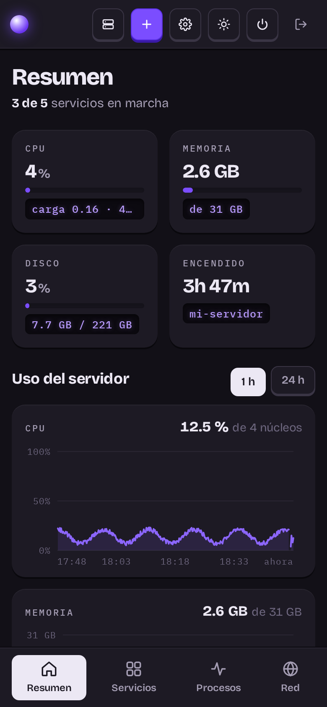

<p align="center"></p>

<h1 align="center">NovaHub</h1>

<p align="center"><b>Panel web para encender, apagar y vigilar los servicios de tu servidor casero.</b><br>
Un solo archivo de Python, sin dependencias ni base de datos.</p>

<p align="center">
  
  
  
</p>

> **English:** NovaHub is a self-hosted web panel to start, stop and monitor the services of a home server
> (bots, websites, game servers, containers): live console, health checks, usage charts, backups, scheduled tasks,
> users and roles, multi-server, Cloudflare Tunnel publishing and a mobile app. Single Python file, no dependencies.
> The interface is in Spanish.



| Ficha de un servicio (tema oscuro) | Nuevo servicio con resumen en vivo |
|---|---|
|  |  |

## Qué hace

- **Servicios**: programas (cualquier comando), **contenedores** (imágenes de Docker Hub con Podman sin root) y
  proyectos **docker-compose**. Encender, apagar, reiniciar, autoarranque y reinicio si se caen. Siguen funcionando
  aunque reinicies o actualices el panel.
- **Consola en directo** con colores, entrada para escribir al proceso y **búsqueda en todo el log**.
- **Vigilancia**: comprobación de salud (web o puerto), límite de memoria, **gráficas** de CPU y RAM (1 h / 24 h),
  avisos por **correo** (Gmail) y vigilante externo (healthchecks.io). Watchdog de systemd para el propio panel.
- **Por servicio**: explorador y **editor de archivos**, **Git** (commit, push, pull), editor del **.env** con los valores
  ocultos, **copias de seguridad** programadas (a otro disco si quieres) y **tareas programadas**.
- **Publicar en internet** con un subdominio a través de **Cloudflare Tunnel**, sin abrir puertos.
- **Desplegar desde GitHub** y **plantillas** (web, React + Vite, API, bot de Discord, Flask, Minecraft); **modo
  producción** para webs con `npm run build`.
- **Usuarios y roles** (administrador, operador, lector), por servicio.
- **Varios servidores** en un mismo panel, por Tailscale.
- **Procesos** del servidor, **red** (túnel, dominios, enchufe Tapo con consumo) y **apagado ordenado** del servidor.
- **App para el móvil**: instalable (PWA) o APK de Android para móviles sin navegador.
- Tema claro y oscuro, adaptado al móvil.



## Instalación

Necesitas Linux con **systemd** y **Python 3.11.4 o superior** (Debian 12/13, Ubuntu 24.04, Raspberry Pi OS…).

```bash
git clone https://github.com/DrackoYT/novahub ~/novahub
cd ~/novahub
python3 server.py set-password     # crea el usuario administrador
python3 server.py                  # → http://127.0.0.1:8686
```

Para que arranque solo con el servidor (como servicio de usuario, sin root):

```bash
mkdir -p ~/.config/systemd/user
cp novahub.service ~/.config/systemd/user/     # revisa las rutas si no lo clonaste en ~/novahub
systemctl --user daemon-reload
systemctl --user enable --now novahub
sudo loginctl enable-linger $USER             # que arranque aunque no inicies sesión
journalctl --user -u novahub -f               # logs del panel
```

El panel escucha solo en `127.0.0.1`. Para entrar desde otros equipos, publícalo con Cloudflare Tunnel (abajo) o
pon `NOVAHUB_HOST` a la IP de la red local. Los datos (servicios, usuarios, logs, métricas) quedan en `data/`, con
permisos 600.

### Configuración

Todo se configura desde el panel salvo estas variables (en `novahub.service`):

| Variable | Para qué |
|---|---|
| `NOVAHUB_HOST`, `NOVAHUB_PORT` | Dónde escucha el panel (por defecto `127.0.0.1:8686`) |
| `NOVAHUB_DATA` | Carpeta de datos (por defecto `data/` junto a `server.py`) |
| `NOVAHUB_DOMAIN` | Dominio para «Publicar en internet» con Cloudflare Tunnel |
| `NOVAHUB_BACKUP_MOUNT` | Disco aparte para las copias (p. ej. `/mnt/datos`); si no está montado, no se copia |
| `NOVAHUB_BACKUP_DIR` | Carpeta de las copias (por defecto `<disco o data>/novahub-copias`) |
| `NOVAHUB_REMOTE_LISTEN` | Puerta para que otro panel maneje este servidor, p. ej. `100.x.y.z:8687` (Tailscale) |
| `NOVAHUB_PROJECTS` | Dónde se clonan los repositorios y las plantillas (por defecto `~/proyectos`) |

### Seguridad

El panel puede ejecutar comandos en el servidor, así que está pensado para estar detrás de algo más que una
contraseña: lo recomendado es **Cloudflare Access** (tu cuenta de Google) delante del túnel. Además: contraseñas con
PBKDF2, sesiones firmadas que caducan por inactividad, protección CSRF, permisos por rol comprobados en el servidor
y nada escuchando fuera de `127.0.0.1`. El modelo completo y las revisiones de código están en
[`SECURITY.md`](SECURITY.md) y [`docs/REVISIONES.md`](docs/REVISIONES.md).

---

# Guía de funciones

## Centro de actualizaciones

Ajustes → **Actualizaciones** reúne todo lo que se puede actualizar en el servidor. Se comprueba solo cada 6 horas
(y con «Comprobar ahora»), avisa por correo y en el Resumen, y guarda un historial.

| Qué | Cómo |
|---|---|
| **NovaHub** | Canal **estable** (versiones publicadas en GitHub) o **desarrollo** (cada cambio). «Actualizar» hace una copia de `data/`, instala la versión, reinicia el panel y comprueba que responde; si no arranca, **vuelve sola a la anterior** (`updater.py`). Los servicios no se paran. |
| **Sistema** | Paquetes de apt pendientes (Python, Node, núcleo, librerías…), marcando los de **seguridad**. «Solo seguridad» o «Actualizar todo», y opción de instalar solas las de seguridad cada noche. |
| **Reinicio pendiente** | Tras actualizar el núcleo: reinicio ordenado del servidor (para los servicios y reinicia). |
| **Servicios** | Imágenes de contenedores nuevas (se descargan una vez por semana; aplicar es reiniciar), servicios con git con cambios en GitHub y dependencias de cada proyecto (`npm update`, `pip` sin saltos de versión mayor) con copia de seguridad previa. |

NovaHub no es root. Para el sistema usa **un único script con órdenes fijas** (`update`, `upgrade`, `security`, `reboot`),
sin parámetros que lleguen del panel. Se instala una vez:

```bash
sudo install -o root -g root -m 755 tools/novahub-sistema /usr/local/sbin/novahub-sistema
echo "$USER ALL=(root) NOPASSWD: /usr/local/sbin/novahub-sistema" | sudo tee /etc/sudoers.d/novahub-sistema
sudo chmod 440 /etc/sudoers.d/novahub-sistema
```

Las versiones siguen el [versionado semántico](https://semver.org/lang/es/) y los cambios de cada una están en
[`CHANGELOG.md`](CHANGELOG.md).

## Publicarlo con Cloudflare Tunnel

El panel escucha solo en `127.0.0.1`; Cloudflare se conecta desde dentro del servidor, así que no hace falta abrir puertos.

1. Instala `cloudflared` y autentícate: `cloudflared tunnel login`
2. Crea el túnel y el DNS:
   ```bash
   cloudflared tunnel create novahub
   cloudflared tunnel route dns novahub panel.tudominio.com
   ```
3. `~/.cloudflared/config.yml`:
   ```yaml
   tunnel: novahub
   credentials-file: /home/<usuario>/.cloudflared/<ID-DEL-TUNEL>.json
   ingress:
     - hostname: panel.tudominio.com
       service: http://localhost:8686
     - service: http_status:404
   ```
4. `cloudflared tunnel run novahub` (o `sudo cloudflared service install` para dejarlo como servicio).

> ⚠️ Quien entre al panel puede ejecutar comandos en tu servidor. Usa una contraseña larga y,
> si puedes, añade **Cloudflare Access** (Zero Trust → Access → Applications) delante del
> dominio para exigir tu email/Google antes de llegar siquiera al login.

### Publicar servicios desde el panel

Con el túnel funcionando, el panel puede dar a cada servicio su propia dirección pública:

1. Añade tu dominio a la unidad de systemd (`~/.config/systemd/user/novahub.service`):
   ```ini
   Environment=NOVAHUB_DOMAIN=tudominio.com
   ```
   y recarga: `systemctl --user daemon-reload && systemctl --user restart novahub`.
2. Crea en el panel un servicio para el túnel con el comando `cloudflared tunnel run novahub`
   (autoarranque + reiniciar si se cae).
3. En cada servicio con puerto aparece el campo **Publicar en internet**: escribe un subdominio
   (p. ej. `mi-app`) y al guardar el panel crea el CNAME `mi-app.tudominio.com`, añade la regla al
   `config.yml` del túnel, rellena la URL del servicio y reinicia el túnel.

Opcionales: `NOVAHUB_TUNNEL` (si no, se usa el `tunnel:` del config) y `NOVAHUB_CLOUDFLARED_CONFIG`
(por defecto `~/.cloudflared/config.yml`). Al despublicar o eliminar un servicio se quita su regla
del túnel, pero **el registro DNS se queda** en Cloudflare (cloudflared no puede borrarlo): bórralo
a mano en *DNS → Records* si ya no lo quieres.

## Sesión

En **⚙ Ajustes → Sesión**: pedir la contraseña al recargar la página (activado por defecto), cerrar la
sesión tras X minutos sin usar el panel (15 por defecto; las actualizaciones automáticas de la pantalla
no cuentan como uso) y una duración máxima (12 h). La cookie es de sesión del navegador y cerrar sesión
invalida el token en el servidor.

## Modo producción para webs

En la ficha de un servicio con `npm run build` (Vite, React, Vue…), **Modo → Pasar a producción**:
NovaHub compila la web y la sirve con `serve.py`, un servidor estático propio (sin dependencias) con
soporte para rutas de SPA, caché larga para los archivos con huella y compresión gzip. Gasta una
fracción de la memoria del modo desarrollo (≈20 MB frente a ≈300 MB en una web Vite). «Recompilar»
aplica los cambios del código; «Actualizar» desde GitHub recompila solo; «Volver a desarrollo»
recupera el comando original. El puerto llega por la variable `NOVAHUB_SERVICE_PORT`.
Se sirve una copia de la compilación (`data/builds/<servicio>/current`), no la carpeta `dist/`: mientras se
recompila, o si la compilación falla, la web publicada sigue funcionando con la versión anterior.

## App para el móvil

NovaHub se instala como app (PWA): icono en la pantalla de inicio y se abre a pantalla completa, sin la barra
del navegador. Sigue yendo por el túnel (tu dominio publicado), con Cloudflare Access y la contraseña.

- **Android (Chrome):** Ajustes → «Instalar NovaHub», o menú ⋮ → «Instalar aplicación».
- **iPhone (Safari):** Compartir → «Añadir a pantalla de inicio».

La interfaz queda guardada en el móvil (`static/sw.js`), así que abre aunque no haya conexión y avisa de que
no puede hablar con el servidor; reintenta sola. Los datos (la API) nunca se guardan: siempre vienen del
servidor. Con «Pedir la contraseña al recargar» activado, la app la pide cada vez que se abre.
Los iconos se generan con `python3 tools/make_icons.py`.

### App de Android (APK), para móviles sin navegador ni Google Play

`android/` es una app mínima (una WebView a pantalla completa, sin Gradle) que abre tu panel. Todo se abre dentro,
también el inicio de sesión de Cloudflare Access; las descargas van a «Descargas».

```bash
# una vez: JDK 17 y las herramientas de Android en ~/android (sin sudo, ~750 MB)
#   JAVA_HOME=~/android/jdk  ANDROID_HOME=~/android/sdk  con «build-tools;34.0.0» y «platforms;android-34»
JAVA_HOME=~/android/jdk ANDROID_HOME=~/android/sdk NOVAHUB_APK_OUT=data/app/NovaHub.apk \
  android/build.sh https://tu-panel.ejemplo.com
```

La firma se crea la primera vez en `~/.novahub-android/` (fuera del repositorio): guárdala, porque para instalar una
versión nueva encima de la anterior hace falta la misma. Con el APK en `data/app/NovaHub.apk`, sale el botón
**Descargar la app para Android** en Ajustes → App para el móvil: descárgalo en el PC, pásalo al móvil y ábrelo con
el gestor de archivos.

Google no deja iniciar sesión con su cuenta dentro de una app (WebView), así que para Cloudflare Access añade el
método **One-time PIN** (te manda un código por correo): Zero Trust → Settings → Authentication → Login methods.

## Vista de red

Pestaña **Red** (tecla `4`):

- **Túnel:** conexiones activas con Cloudflare, centros a los que está conectado (p. ej. `mad05 · mad07`),
  peticiones y errores del servidor (respuestas 5xx). Se leen del servidor de métricas de cloudflared, así que el comando del túnel debe
  llevar `--metrics 127.0.0.1:PUERTO`.
- **Servidor:** IP en la red local y dominio de publicación.
- **Enchufe Tapo:** encendido o apagado, consumo en vatios en este momento (P110/P115), kWh de hoy y del
  mes, desde cuándo está encendido y calidad del Wi-Fi. Se consulta como mucho una vez por minuto.
- **Dominios publicados:** cada regla del `config.yml` del túnel con el servicio al que lleva, su estado
  y si pasa por la pasarela de NovaHub.

## Gráficas de uso

En **Resumen** (todo el servidor) y en la ficha de cada servicio hay dos gráficas, CPU y memoria, con
selector **1 h / 24 h**. Al pasar el ratón (o el dedo) se ve el valor de cada momento.

- Una muestra cada 10 s para la gráfica de 1 h y una media cada 5 min para la de 24 h. Se guardan en
  `data/metrics.json` cada 5 min y al cerrar NovaHub, así que sobreviven a un reinicio.
- La CPU del servidor es el % del total; la de un servicio, % de un núcleo (como en `top`: 200 % = dos
  núcleos llenos). En la memoria de un servicio con límite se dibuja el límite como línea roja.
- Los huecos son ratos en que el servicio estaba parado (o NovaHub apagado).

## Varios servidores

Un panel puede manejar otros servidores que tengan NovaHub. Con el **selector de arriba** eliges cuál ves: todo el
panel (servicios, consolas, gráficas, copias…) pasa a ser el de ese servidor, con la cabecera en morado para que
se note. En **Resumen** salen los demás con su estado.

Las peticiones viajan por **Tailscale** (red privada y cifrada, sin abrir puertos en el router):

1. En el otro servidor (Linux): instala NovaHub y Tailscale con tu misma cuenta.
2. En su `novahub.service`, abre la puerta para otros paneles en su IP de Tailscale y reinícialo:
   ```ini
   Environment=NOVAHUB_REMOTE_LISTEN=100.x.y.z:8687
   ```
   Esa puerta **solo** acepta llaves de acceso: no tiene interfaz ni inicio de sesión. Si la IP aún no existe al
   arrancar, lo reintenta cada 30 s.
3. En el NovaHub de ese servidor: Ajustes → **Acceso remoto** → crea una llave (`nh_…`). Se muestra una vez; allí
   se guarda solo su huella, y se puede revocar cuando quieras.
4. En tu panel: Ajustes → **Servidores** → nombre, `http://100.x.y.z:8687` y la llave. Antes de guardarlo comprueba
   que conecta y que la llave es de un administrador.

Solo los administradores de este panel pueden usar otros servidores. La llave queda en `data/servers.json`
(permisos 600); la sesión de este panel se alarga mientras trabajas en otro servidor.

## Usuarios y permisos

Cada persona entra con su **usuario y contraseña**. Ajustes → **Usuarios** (solo administradores) para crearlos,
cambiarles el rol o los servicios y borrarlos; cada uno cambia su contraseña en Ajustes → **Mi cuenta**.

| Rol | Puede |
|---|---|
| **Administrador** | Todo: servicios, archivos, git, variables, copias, tareas, ajustes, usuarios, apagar el servidor |
| **Operador** | Ver, encender, apagar y reiniciar, escribir en la consola, lanzar una copia o una tarea |
| **Lector** | Ver estado, gráficas y logs |

- A un operador o lector se le pueden dar **todos los servicios o solo algunos**: los demás ni los ve.
- Los permisos los comprueba el servidor en cada petición, con «denegado por defecto»: lo que no está permitido
  expresamente para un rol es solo para administradores. A quien no es administrador tampoco le llegan comandos,
  rutas, variables ni los comandos de las tareas.
- Cambiar la contraseña, el rol o los servicios de alguien cierra sus sesiones abiertas.
- Siempre queda al menos un administrador, y nadie puede borrarse ni quitarse el rol a sí mismo.
- Desde la terminal: `python3 server.py set-password [usuario]` (crea un administrador si no existe).
- Para que alguien llegue desde internet, añade también su correo a la regla de **Cloudflare Access**.
- La primera vez, la contraseña única de antes pasa a ser la del usuario administrador con el nombre del usuario
  del sistema.

## Catálogo de apps

Nuevo servicio → **Catálogo de apps**: alternativas propias a servicios de empresas, ya configuradas (puertos, carpetas,
variables y claves generadas). Un clic las instala como un servicio más (contenedor o compose), con copias de seguridad,
salud, gráficas y publicación como cualquier otro, y en su ficha salen los **primeros pasos**.

| Categoría | Apps |
|---|---|
| Privacidad | Vaultwarden (contraseñas), Immich (fotos), Nextcloud (archivos), Radicale (calendario y contactos), ntfy (avisos al móvil), SearXNG (buscador) |
| Multimedia | Jellyfin (películas y series), Navidrome (música), Calibre-Web (libros) |
| Productividad | Paperless-ngx (documentos), Mealie (recetas), Actual Budget (finanzas), FreshRSS (noticias) |
| Herramientas | Stirling-PDF, File Browser, Syncthing, Forgejo (git propio) |
| Otras | Home Assistant (domótica), Uptime Kuma (vigilancia), Minecraft |

El catálogo es [`catalogo.json`](catalogo.json): añadir una app es añadir una entrada (imagen, puertos, carpetas, variables
con marcadores como `{secret}` o `{url}`, y notas). Las apps de varios contenedores descargan su compose oficial.
Las carpetas van por defecto a `~/apps/<app>` (`NOVAHUB_APPS_DIR`).

### Gestor de contraseñas (Vaultwarden)

Vaultwarden es compatible con las apps y extensiones de Bitwarden (Android, iPhone, Chrome, Firefox…). Al instalarlo:

- **HTTPS obligatorio:** el navegador y las apps lo exigen, así que el formulario propone publicarlo en
  `vault.<tu dominio>`. No lo pongas detrás de Cloudflare Access: las apps de Bitwarden no pueden pasar ese login.
- **Registro controlado:** entra en su dirección y crea tu cuenta. En cuanto existe, NovaHub cierra el registro solo
  (`SIGNUPS_ALLOWED=false`) y reinicia el contenedor, así que nadie más puede crear cuentas aunque esté en internet.
  En la ficha, «Registro de cuentas» muestra cuántas hay y permite **abrirlo para una cuenta más** (familia); se vuelve
  a cerrar tras ella. El panel `/admin` queda desactivado y las pistas de contraseña ocultas.
- **Copias diarias desde el primer día** (03:30, 14 días), con la base de datos copiada sin cortes. Las contraseñas ya
  van cifradas con tu contraseña maestra; para tenerlas también fuera de casa, añade un destino en **Copias fuera de
  casa** (restic, cifrado).
- En las apps de Bitwarden: «Autoalojado» (self-hosted) → `https://vault.<tu dominio>`.

### Fotos (Immich)

Alternativa a Google Fotos: copia automática desde el móvil, caras, mapas y álbumes compartidos.

- **Fotos en el disco duro:** el formulario pide la «Carpeta de las fotos», por defecto en el disco de datos
  (`/mnt/dades/immich`), y la base de datos se queda en la carpeta de la app (SSD, más rápida).
- **Copias:** Immich guarda cada noche una copia de su base de datos en `<fotos>/backups`. Las **Copias fuera de casa**
  se llevan la carpeta de fotos directamente (restic: incremental, sin duplicarla en un .tar.gz), sin miniaturas ni
  vídeos recodificados, que se regeneran. La copia local del servicio guarda su configuración (`.env`), nunca la carpeta
  viva de PostgreSQL, que copiada en marcha no sirve.
- **Móvil:** app «Immich» (F-Droid, Google Play o el APK de sus releases). Cloudflare corta las subidas de más de 100 MB,
  así que en la app activa el **cambio automático de URL**: con el Wi-Fi de casa usa la dirección local
  (`http://<ip>:2283`) y fuera, la publicada.

## Contenedores (Podman)

Además de programas (un comando), un servicio puede ser un **contenedor** (una imagen de Docker Hub u otro
registro) o un proyecto **docker-compose**. Nuevo servicio → **Contenedor**, o el selector «Tipo» del formulario.

Se usa **Podman sin root**: los contenedores corren como tu usuario, sin servicio de root ni grupo `docker`
(que equivaldría a dar root a quien controle el panel). Instalación:

```bash
sudo apt install -y podman podman-compose passt uidmap
```

- **Contenedor:** imagen (p. ej. `louislam/uptime-kuma:1`), puerto del servidor y del contenedor, carpetas
  (`data:/app/data`; las relativas van dentro del directorio del servicio, que se crea solo) y variables de
  entorno, que se pasan sin aparecer en la lista de procesos. Ejemplos listos: Uptime Kuma, web estática con
  nginx y Minecraft (Paper).
- **Compose:** el directorio del servicio con su `compose.yaml` o `docker-compose.yml`. Los logs de todos los
  contenedores salen en la consola, cada uno con su nombre.
- Se vigilan como cualquier servicio: consola (también para escribirles), reinicio si se caen, comprobación
  de salud, límite de memoria, gráficas, tareas programadas, copias de seguridad y publicación en internet.
  La CPU y la memoria se leen de su cgroup, porque sus procesos no son hijos de NovaHub. La comprobación de salud no
  cuenta fallos hasta que responden por primera vez (máx. 15 min): la primera vez descargan GB de imágenes.
- **Actualizar imagen** descarga la versión nueva y reinicia solo si ha cambiado.
- Al parar, el contenedor recibe su señal de parada con el tiempo de «Espera»; después se elimina (los datos
  quedan en sus carpetas).

## Identidad de git

Los commits que se hacen desde el panel (pestaña Git) se firman con el nombre y el correo de
**Ajustes → Git**, que es la configuración global de git del usuario (`git config --global user.name/user.email`).
Si no están puestos, el commit avisa en vez de inventarse un autor.

## Variables (.env)

Pestaña **Variables** en la ficha: el `.env` del proyecto como tabla nombre → valor, con los valores ocultos
(el ojo muestra cada uno). Se puede elegir otro archivo (`.env.local`, `.env.production`…) y crear el `.env` si
no existe.

- Conserva comentarios, líneas en blanco y el formato de lo que no cambia; lo nuevo va al final. Pone comillas
  cuando hace falta (espacios, `#`, comillas…).
- Guarda la versión anterior (como el editor) y avisa si el archivo cambió desde que lo abriste.
- Un `.env` nuevo se crea con permisos 600 (solo tu usuario).
- **Aviso si el archivo iría a GitHub**: si no está en `.gitignore` o ya está en el repositorio.
- Si una variable está repetida, cuenta la última (como en dotenv y en el shell) y al guardar queda una.
- Casi todos los programas leen el `.env` al arrancar: tras guardar sale «Reiniciar para aplicar».

Las variables que se ponen en «Editar» del servicio son otra cosa: las pasa NovaHub al arrancarlo y se guardan
en `data/services.json`.

## Buscar en los logs

En la consola de cada servicio, el campo **Buscar en todo el log** (o la tecla `/`) busca en el log entero,
el actual y el anterior rotado, no solo en lo que hay en pantalla. Muestra las coincidencias con su número de
línea y resaltadas (las 500 más recientes), y se actualiza solo mientras está abierta.

- **Solo errores:** líneas con palabras de error (error, failed, exception, traceback, rechazada…) o que el
  programa pinta en rojo, como los fallos que anota NovaHub.
- **`.*`** para expresiones regulares y **Aa** para distinguir mayúsculas.
- `Esc` o ✕ vuelven a la consola en directo.

## Tareas programadas

Pestaña **Tareas** en la ficha de cada servicio. Cada tarea es una acción a una hora, ciertos días de la semana:

- **Encender, apagar o reiniciar.** Para que un servicio solo funcione en un horario, dos tareas:
  encender a las 09:00 y apagar a las 23:00.
- **Escribir en la consola** del proceso (p. ej. `say Reinicio en 5 minutos` en Minecraft).
- **Ejecutar un comando** en la carpeta del servicio, con sus variables de entorno. Se corta a los 10 min.

Se ejecutan aunque no tengas el panel abierto; lo que pasa queda en la consola del servicio y, si una
falla, llega un aviso por correo. «Probar» la lanza en el momento. Si NovaHub estaba reiniciándose justo
a esa hora, la tarea se lanza igualmente hasta 3 minutos tarde (nunca dos veces).

## Copias de seguridad

Pestaña **Copias** en la ficha de cada servicio:

- **Dónde:** en el disco duro de datos (HDD, `/mnt/dades/novahub-copias/<servicio>/`), no en el SSD
  del sistema, para que un fallo del SSD no se lleve también las copias. Si el disco no está montado,
  NovaHub no hace la copia (no escribe en el SSD por error) y avisa. Se puede cambiar con
  `NOVAHUB_BACKUP_DIR` y `NOVAHUB_BACKUP_MOUNT`.
- **Nombre:** `bk_DDMMAA_HHMMSS_tipo.tar.gz`, p. ej. `bk_061026_040000_auto.tar.gz` (copia del 6/10/26).
  El panel muestra la fecha corta (`bk_061026`) en la lista y en la tarjeta del servicio («Copia»).
- **Cuándo:** a mano («Hacer copia ahora») o automáticas cada día a una hora o cada X horas.
- **Qué:** toda la carpeta o solo algunas subcarpetas, sin lo que se regenera (`node_modules`, `.git`,
  `.venv`…). Opción de parar el servicio durante la copia (juegos, bases de datos).
- **Bases de datos SQLite** (Vaultwarden, Uptime Kuma, ntfy…): se copian con la API de copia de SQLite, que da una
  copia coherente aunque la app esté escribiendo, en lugar de copiar el archivo y su `-wal` a medias.
- **Retención:** se guardan las N últimas automáticas y las 3 últimas «antes de restaurar»; las manuales
  solo se borran a mano.
- **Restaurar:** para el servicio, guarda antes una copia del estado actual, deja la carpeta como en la
  copia (sin tocar lo excluido) y lo vuelve a arrancar. También se pueden descargar y borrar.

## Copias fuera de casa

Ajustes → **Copias fuera de casa**: las copias locales de los servicios (`novahub-copias`) y la configuración de NovaHub
(`data/`: servicios, usuarios, ajustes), además de las carpetas de datos grandes de las apps (las fotos de Immich, sin
las miniaturas), van **cifradas** con [restic](https://restic.net) (libre: `sudo apt install restic`)
a uno o varios destinos tuyos, **sin servicios de terceros ni suscripciones**:

- **Disco USB o externo**: una carpeta del disco. Si no está conectado a la hora de la copia, se espera a la siguiente.
- **Otro servidor** por SSH (el de un familiar, una Raspberry…, mejor por Tailscale): NovaHub crea su propia llave SSH
  (`data/ssh/`) y la añades al `authorized_keys` de un usuario de ese servidor.

Copia diaria e incremental (solo viaja lo nuevo), retención de 7 diarias, 4 semanales y 6 mensuales, y cada 30 días se
comprueba el destino y **se restaura de verdad un archivo** para confirmar que sirve. «Recuperar» saca una copia completa a
`~/novahub-recuperado/` sin tocar nada de lo actual. La contraseña de cifrado se genera (o pones la tuya) y se enseña
una vez: **guárdala fuera del servidor**, porque sin ella no se pueden recuperar las copias. En el destino no queda nada
legible sin ella.

## Fiabilidad de NovaHub

- **Watchdog de systemd** (`Type=notify`, `WatchdogSec=30` en `novahub.service`): NovaHub avisa a systemd
  cada 10 s mientras su web, su pasarela y sus bucles internos responden; si algo se queda colgado,
  systemd lo reinicia. Tus servicios no se tocan (`KillMode=process`).
- **Hilos vigilados**: si muere el de correo, salud, pasarela o vigilancia, se relanza y se avisa.
- **Reinicios tras un fallo**: NovaHub sabe si la vez anterior se cerró bien; si no, te escribe
  («se ha reiniciado tras un fallo», o «el servidor se ha encendido tras un apagado inesperado»).
- **Autoarranque** = al encender el servidor. Si solo se reinicia NovaHub, lo que apagaste sigue apagado.
- **Vigilante externo** (healthchecks.io u otro servicio con dirección de ping): en ⚙ Ajustes. NovaHub
  manda una señal de vida cada minuto solo si todo responde; si dejan de llegar (corte de luz, sin
  internet, servidor colgado), el servicio externo te avisa. Configura allí 1 min de periodo y 3 de gracia.
- **Túnel**: arranca con `--metrics 127.0.0.1:20241` y su comprobación de salud usa `/ready`, que solo
  responde 200 si hay conexión con Cloudflare.

## Avisos

Ajustes → **Avisos**: NovaHub te avisa cuando un servicio se cae, deja de responder o se pasa de memoria, cuando el
servidor se enciende o se apaga, si falla una copia, una tarea o una actualización, y cuando hay actualizaciones. Como
mucho un aviso por servicio y tipo cada 10 minutos. Para cada tipo eliges si va al móvil, al correo o a los dos.

- **Móvil con ntfy** (recomendado, sin terceros): instala **ntfy** desde el catálogo y pulsa **«Proteger y conectar»**.
  ntfy queda con todo denegado por defecto, un usuario `movil` que solo puede leer y una llave para NovaHub que solo
  puede publicar en su tema. NovaHub le envía los avisos por dentro del servidor (no depende del túnel), con prioridad
  máxima para los problemas graves. En el móvil, la app **ntfy** (Google Play o F-Droid; en iPhone, App Store) con la
  dirección pública, el usuario `movil` y el tema `novahub`. También vale cualquier otro servidor ntfy (dirección, tema
  y llave a mano).
- **Correo con Gmail** (opcional): una [contraseña de aplicación](https://myaccount.google.com/apppasswords) de Google
  (no tu contraseña normal). Correos en HTML con las últimas líneas de la consola. Sin cuenta, desactivado.

## Apagar el servidor (y el enchufe Tapo)

El botón ⏻ de la barra superior para todos los servicios (con su comando de parada), programa en el
enchufe Tapo un corte de corriente dentro de 90 s y apaga el servidor con `systemctl poweroff`.
Se habla con el enchufe por la red local: no hace falta Alexa ni la nube.

1. **Permiso para apagar** (una vez):
   ```bash
   echo "$USER ALL=(root) NOPASSWD: /usr/bin/systemctl poweroff" | sudo tee /etc/sudoers.d/novahub-poweroff
   sudo chmod 440 /etc/sudoers.d/novahub-poweroff && sudo visudo -c
   ```
2. **Enchufe Tapo** (opcional; sin él el servidor se apaga igual pero el enchufe sigue encendido):
   ```bash
   python3 -m venv --without-pip .venv
   curl -fsSL https://bootstrap.pypa.io/get-pip.py | .venv/bin/python
   .venv/bin/pip install python-kasa
   ```
   Crea `data/tapo.json` con la IP del enchufe (fíjala en el router) y tu cuenta Tapo, y protégelo:
   ```json
   {"host": "192.168.0.50", "username": "email@cuenta-tapo", "password": "..."}
   ```
   `chmod 600 data/tapo.json`, y comprueba: `.venv/bin/python tapo.py status` y `.venv/bin/python tapo.py test`
   (programa un «encender» inofensivo en 30 s para verificar que el enchufe acepta cuentas atrás).
3. **Encendido automático**: en la BIOS activa *Restore on AC Power Loss → Power On*. Así, al encender el
   enchufe (app Tapo, Alexa o botón) el servidor arranca solo, y NovaHub levanta los servicios con autoarranque.

## Consejos para los servicios

- **El comando** se ejecuta con `bash -lc` dentro del directorio de trabajo, así que funcionan
  `source venv/bin/activate && python bot.py`, `npm run start`, `java -Xmx4G -jar server.jar nogui`, etc.
- **No uses comandos que se vayan a segundo plano** (`&`, `nohup`, `--daemon`, `pm2 start`…):
  el panel tiene que ser el que mantenga vivo el proceso para poder vigilarlo y pararlo.
- **Si la consola tarda en mostrar la salida**, el programa está acumulando la salida en un buffer.
  Python ya va sin buffer (`PYTHONUNBUFFERED=1`); en otros casos prueba `stdbuf -oL tu-comando`.
- **Puerto**: si lo indicas, la tarjeta muestra en verde si realmente está escuchando.
  Es la forma más fiable de saber si el servicio "ha arrancado de verdad".

## Estructura del código

```
server.py          backend (API + gestor de procesos + consola por SSE)
static/            interfaz web (HTML/CSS/JS sin frameworks) y app para el móvil (manifiesto, sw.js, iconos)
serve.py           servidor estático del modo producción
catalogo.json      catálogo de apps autoalojadas (imagen, puertos, carpetas, variables y notas)
updater.py         actualiza NovaHub desde fuera y vuelve atrás si la versión nueva no arranca
logsearch.py       búsqueda en los logs (las expresiones regulares van en un proceso aparte con límite de tiempo)
tapo.py            control del enchufe Tapo
tools/             utilidades (generar los iconos de la app)
novahub.service    unidad de systemd
data/              se crea al arrancar (no subir a git)
```

## Licencia

[MIT](LICENSE) © DrackoYT. Las fuentes incluidas (Bricolage Grotesque, Unbounded, IBM Plex Mono) tienen licencia
SIL Open Font License.
