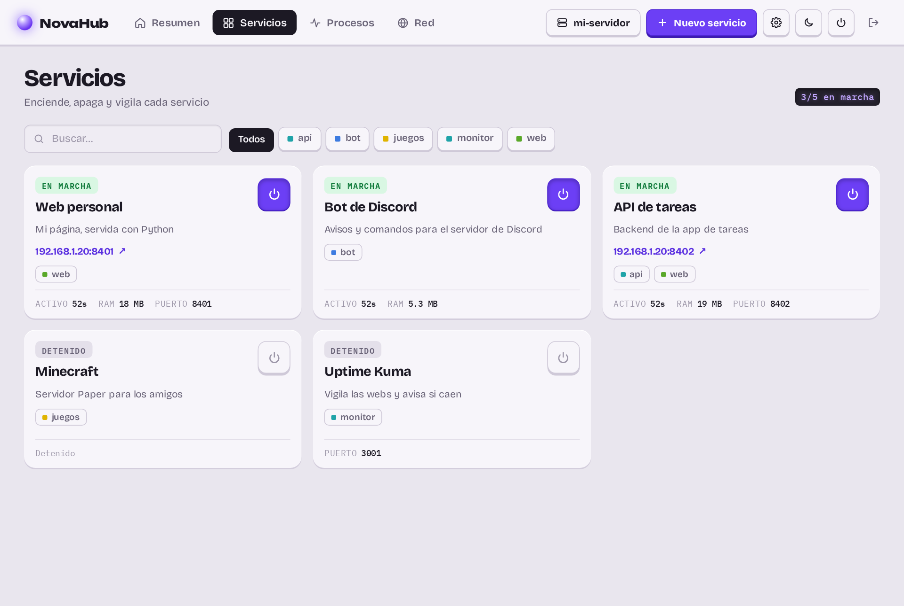

# Servicios

La pestaña **Servicios** lista todo lo que NovaHub gestiona, con su estado, CPU, memoria, puerto y dirección pública.
Se filtra por etiqueta o buscando por nombre, y cada tarjeta tiene su interruptor para encender o apagar.

## Tipos de servicio

| Tipo | Qué ejecuta | Más información |
|---|---|---|
| Programa | Cualquier comando: `python3 bot.py`, `npm start`, `java -jar server.jar`… | [Tu primer servicio](primer-servicio.md) |
| Contenedor | Una imagen de Docker Hub u otro registro, con Podman sin root | [Contenedores](contenedores.md) |
| Compose | Un proyecto `docker-compose.yml` con varios contenedores | [Contenedores](contenedores.md) |
| App del catálogo | Un contenedor o compose ya configurado (Vaultwarden, Immich…) | [Catálogo de apps](catalogo.md) |

## Estados

| Estado | Significa |
|---|---|
| En marcha | El proceso está vivo |
| Arrancando / Parando | En transición; los botones esperan a que termine |
| Reintentando | Se cayó y NovaHub lo vuelve a lanzar. Tras varios fallos seguidos espera más entre intentos |
| Caído | Terminó con error y no se va a reintentar más (o tiene el reinicio desactivado) |
| Parado | Apagado a propósito |

## Qué vigila NovaHub de cada servicio

- **Que siga vivo**: si termina con error y tiene «Reiniciar si se cae», lo vuelve a lanzar y te avisa.
- **Que responda**: con puerto, cada 30 s comprueba que contesta (web o puerto abierto). Tras 3 fallos seguidos lo
  reinicia. Los contenedores tienen margen hasta su primera respuesta (la primera vez descargan sus imágenes).
- **Memoria**: si tiene límite y lo pasa, lo reinicia.
- **Uso**: CPU y memoria cada pocos segundos, guardadas para las [gráficas](vigilancia.md).

> [!TIP]
> En la ficha de cada servicio, «Editar» cambia cualquier ajuste. Los cambios se aplican la próxima vez que arranque:
> si está encendido, reinícialo.

## Más en esta sección

- [Contenedores (Podman)](contenedores.md)
- [Catálogo de apps](catalogo.md)
- [Consola, logs y variables](consola.md)
- [Tareas programadas](tareas.md)
- [Modo producción para webs](produccion.md)
